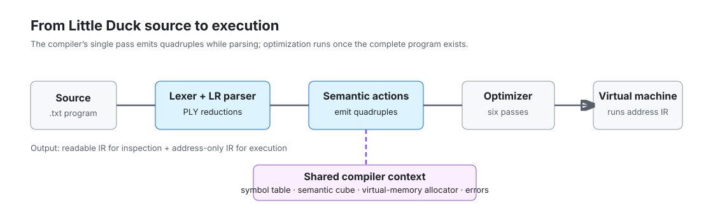
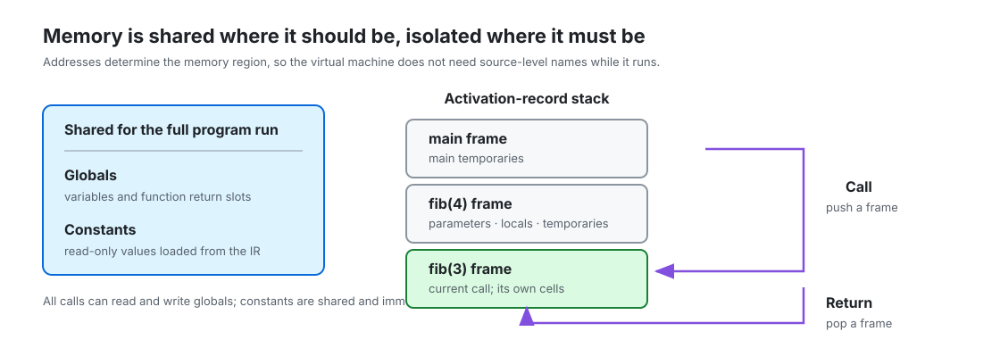
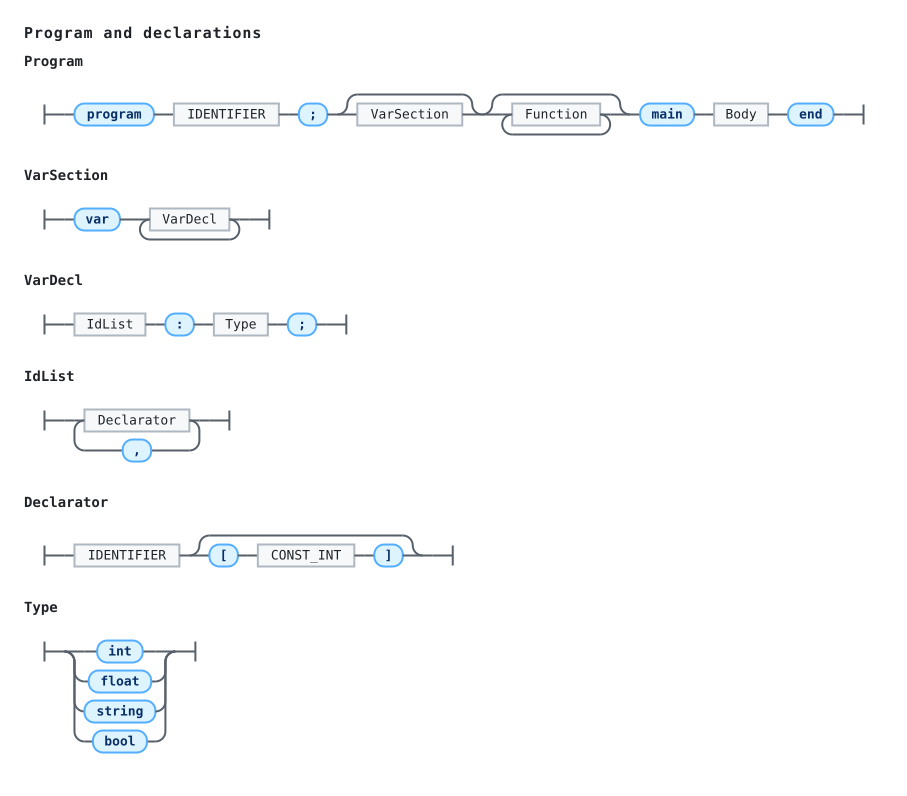
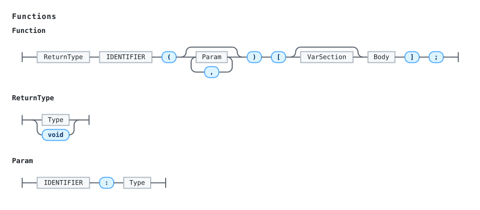
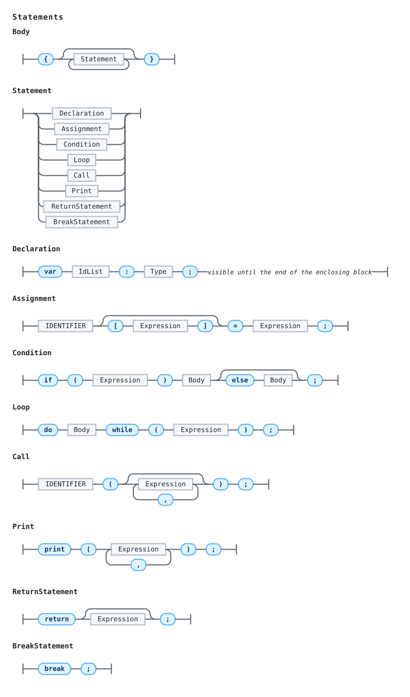
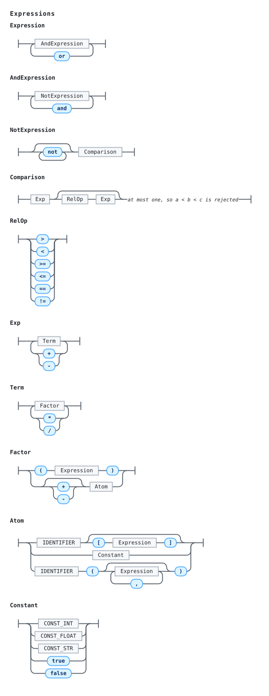

# Little Duck

A compiler and virtual machine for **Little Duck**, a small imperative
language, written in Python with [PLY](https://github.com/dabeaz/ply)
(lex/yacc).

The compiler runs in a single pass: while the LR parser reduces the grammar it
also fills the symbol table, checks types against a semantic cube, allocates
virtual memory addresses and emits quadruples. The result is an intermediate
representation written entirely in addresses, which a separate virtual machine
loads and executes.

## Highlights

- A one-pass LR compiler with syntax recovery and accumulated diagnostics.
- Static typing, nested block scopes, arrays, functions and recursion.
- Address-only quadruple IR, a separate virtual machine and source-aware
  runtime errors.
- Conservative optimization: constant folding and propagation, control-flow
  simplification, dead-result removal and unreachable-code removal.
- 47 end-to-end programs covering successful execution, compilation failures,
  optimizer behavior and runtime failures.

## Quick start

Little Duck requires Python 3 and the dependencies in `requirements.txt`.
The commands below use `python3`; substitute the interpreter name your system
uses if needed.

```bash
python3 -m venv .venv
source .venv/bin/activate
python3 -m pip install -r requirements.txt
python3 run_tests.py
```

Compile and run a program:

```bash
python3 main.py tests/programs/arithmetic.txt
```

With no arguments the entry point reads `input.txt`:

```bash
python3 main.py
```

Two files are written next to the program: `ir-names.txt`, a readable listing
meant for inspection, and `ir-addresses.txt`, the address-only listing the
machine executes. Use `--ir-base NAME` to change the base name.

The quadruples are optimized before they are written. `--no-optimize` emits
them exactly as the parser produced them, and `--optimize-report` says what the
pass changed:

```bash
python3 main.py tests/optimized/constant_folding.txt --optimize-report
```

The virtual machine is a program of its own and can run a listing directly,
without going through the compiler again:

```bash
python3 -m littleduck.vm ir-addresses.txt
```

The exit status is `0` when the program ran to completion, and `1` when
compilation failed or the program hit a runtime error.

## Project layout

```
main.py                    command-line entry point: compile, then run
littleduck/
    lexer.py               tokens and the PLY lexer
    grammar.py             the LR grammar with its semantic actions
    semantics.py           the semantic cube
    symbols.py             function directory and variable tables
    memory.py              virtual memory layout and address allocation
    quadruples.py          the intermediate representation
    flow.py                reachability over the generated quadruples
    context.py             the state shared by every phase
    optimizer.py           constant folding and dead-code removal
    ir.py                  address resolution and the output files
    compiler.py            the compilation driver
    errors.py              error collection and reporting
    vm/
        loader.py          reads an address listing back into memory
        memory.py          simulated memory and activation records
        machine.py         the interpreter
        errors.py          runtime errors
        __main__.py        `python3 -m littleduck.vm`
docs/
    grammar_diagram.py     regenerates the railroad diagrams above
    grammar-*.svg          the diagrams themselves, light and dark
    compiler-pipeline.svg  compilation and execution stages
    runtime-memory.svg     shared memory and activation records
run_tests.py               runs every program under tests/ and checks its output
requirements.txt           runtime dependency pins
requirements-docs.txt      runtime and diagram-generation dependency pins
.github/workflows/test.yml runs the test suite on supported Python versions
LICENSE                    MIT License
tests/
    programs/              programs that compile and run
    optimized/             programs run with the optimizer's report on
    compile-errors/        programs rejected at compile time
    runtime-errors/        programs that compile but fail while running
```

## Architecture

The compiler translates source to an executable, address-only intermediate
representation; the virtual machine can also load that representation directly.



The runtime separates shared program memory from one local-and-temporary frame
per active call, which is what makes recursion work without a symbol table.



## Grammar diagrams

Railroad diagrams provide a complete visual reference for the grammar. They
are generated from the productions in `littleduck/grammar.py`.

<details>
<summary><b>Program and declarations</b></summary>
<picture>
  <source media="(prefers-color-scheme: dark)" srcset="docs/grammar-program-dark.svg">
  
</picture>
</details>

<details>
<summary><b>Functions</b></summary>
<picture>
  <source media="(prefers-color-scheme: dark)" srcset="docs/grammar-functions-dark.svg">
  
</picture>
</details>

<details>
<summary><b>Statements</b></summary>
<picture>
  <source media="(prefers-color-scheme: dark)" srcset="docs/grammar-statements-dark.svg">
  
</picture>
</details>

<details>
<summary><b>Expressions</b></summary>
<picture>
  <source media="(prefers-color-scheme: dark)" srcset="docs/grammar-expressions-dark.svg">
  
</picture>
</details>

Regenerate them after changing the grammar:

```bash
python3 -m pip install -r requirements-docs.txt
python3 docs/grammar_diagram.py
```

## The language

```
program name;
var a, b : int;
    x : float;
    s : string;
    ready : bool;
    values[4] : int;

int add(p : int, q : int) [
    var scratch : int;
    {
        scratch = p + q;
        return scratch;
    }
];

void report() [
    {
        # A function reads and writes the globals directly.
        print("a is ", a);
    }
];

main {
    a = (2 + 3) * 4;
    x = a / 2;

    ready = x >= 1.0 and not (a == 0);
    if (ready or s == "always") {
        print("x is ", x);
    } else {
        print("x is small");
    };

    values[0] = a;
    values[a - 19] = add(a, 3);
    print(values[1]);

    do {
        var step : int;      # declared here, gone at the closing brace
        step = a - 1;
        a = step;
        if (a == 5) { break; };
    } while (a > 0);

    report();
    b = add(a, 3);
}
end
```

Types are `int`, `float`, `string` and `bool`; functions may also be `void`. A
declaration that gives a size — `values[4] : int` — declares an array of that
many elements, indexed from zero. Function bodies are delimited by `[ ]`,
blocks by `{ }`, and every statement — including `if` and `do/while` — ends
with a semicolon. Comments start with `#`. `print` takes one or more arguments
and adds a line break of its own.

`and` and `or` short-circuit: the right operand is only evaluated when the left
one has not already settled the answer. They take booleans on both sides and
nothing else — there is no implicit conversion, so `if (n and m)` over two
integers is rejected rather than quietly reading zero as false.

A `var` may also appear as a statement, in which case it belongs to the block
it is written in and goes out of scope at the closing brace. Each such
declaration writes its own `var`; the section at the top of a program or a
function writes it once and lists several declarations under it.

## How it works

### 1. Lexical analysis

Reserved words: `program`, `var`, `main`, `end`, `int`, `float`, `string`,
`bool`, `void`, `if`, `else`, `do`, `while`, `print`, `return`, `break`,
`true`, `false`, `and`, `or`, `not`.

Operators and delimiters: `+ - * / = < > <= >= == != , ; : { } [ ] ( )`, plus
the three word-shaped operators `and`, `or` and `not`. Constants are
`CONST_INT`, `CONST_FLOAT`, `CONST_STR` and the two boolean words; identifiers
start with a letter.

Two rules exist purely to report problems: `t_BAD_IDENTIFIER` catches names
that start with a digit or an underscore (`12abc`, `_x`) before the integer
rule can split them in two, and `t_error` reports unrecognized symbols. Neither
one stops the scan.

### 2. Syntax analysis

The start symbol is `Program`. Precedence is built into the grammar through a
chain of rules rather than through PLY precedence declarations, and
`Comparison` is not recursive, so an expression accepts at most one relational
operator and `a < b < c` is rejected.

```
Program        -> ProgramHeader ; OptVars FunctionList main Body end
Body           -> { StatementList }
StatementList  -> StatementList Statement | empty
Statement      -> Declaration | Assignment | Condition | Loop | Call
                | Print | ReturnStatement | BreakStatement
Declaration    -> var IdList : Type ;

Expression     -> Expression or AndExpression | AndExpression
AndExpression  -> AndExpression and NotExpression | NotExpression
NotExpression  -> not NotExpression | Comparison
Comparison     -> Exp RelOp Exp | Exp
Exp            -> Exp + Term | Exp - Term | Term
Term           -> Term * Factor | Term / Factor | Factor
Factor         -> ( Expression ) | + Atom | - Atom | Atom
Atom           -> IDENTIFIER | IDENTIFIER [ Expression ]
                | Constant | CallExpression

Declarator     -> IDENTIFIER | IDENTIFIER [ CONST_INT ]
```

Each level of that chain binds tighter than the one above it, so `or` is the
loosest operator and the arithmetic ones are the tightest.

Recovery rules (`Statement : error SEMICOLON`, `Body : LBRACE error RBRACE`,
and their siblings) let the parser resynchronize at the next `;` or `}` and
keep reporting. Each recovery point is noted in the error report. Past 50
syntax errors the parser is assumed to be looping and the run is abandoned.

### 3. Semantic analysis

**Function directory.** Every scope — the program itself and each function —
is one `FunctionEntry` holding its return type, its parameters in declaration
order, its variable table, the quadruple it starts at, and how much memory it
needs.

**Scopes nest.** A name is looked up in the blocks currently open, innermost
first, then in the scope's own parameters and top-level locals, then in the
global variables. A function does not see another function's names, which is
what lets every function reuse the same range of local addresses.

Every `{ }` is a scope: a `var` written as a statement belongs to the block it
appears in and is gone at the closing brace. A declaration may reuse a name
from an enclosing scope, in which case it hides it for as long as it is open,
and two blocks side by side may each declare their own — with different types
if they like, since each declaration is a variable of its own with its own
address.

That is also why a quadruple carries the variable itself rather than its name:
two variables that share a name never have to be told apart by name later on.
Resolving an operand is reading its address. The readable listing has only the
name to go on, so it numbers same-named variables of one scope, `label~1` and
`label~2`.

**Semantic cube.** `CUBE[left][right][operator]` gives the result type or
`error`. The rules that matter:

- `+ - *` between `int`/`float`, with `float` winning.
- `/` between numerics always produces `float`.
- Comparisons produce `bool`; `==` and `!=` also accept two strings or two
  booleans.
- `and` and `or` take `bool` on both sides and produce `bool`. `not` is the
  one logical operator with a single operand, so it does not fit the cube and
  has a rule of its own.
- Assignment allows `float = int` but not `int = float`.
- No type converts implicitly into another, so a number is never read as a
  condition and a boolean is never read as a number.

Assignment is modelled as an operator with the destination type on the left,
so the same table checks assignments, arguments and return values.

**Checks performed.** Variables declared before use; compatible types in
operations and assignments; calls matching their signature in arity and type;
boolean conditions in `if` and `while`; `return` only inside a function and
with the right type; a non-`void` function having at least one `return` with a
value and returning one on every path; `break` only inside a loop; names not
colliding between variables and functions, and not declared twice in the same
scope; and arrays used one element at a time, with an `int` index and an
element type that matches.

**Partial returns.** Whether every path through a typed function reaches a
`return` cannot be answered from the grammar, since the compiler builds no
syntax tree. It is answered from the quadruples instead: the jumps between
them already describe the control flow of the body, so walking them from the
function's first instruction shows whether its `endfun` is reachable without
passing through a `return`. `littleduck/flow.py` does that walk.

The check stays quiet unless it has something new to say. A function with no
value return at all is already reported by the check above, and one whose
`return` failed its type check emits no `return` quadruple — so its flow graph
is missing a path the source really has, and accusing it of a partial return
would be wrong. Both cases are skipped.

### 4. Virtual memory

Every variable, parameter, temporary and constant gets an address that encodes
both its scope and its type:

| Region   | int   | float | string | bool  | void  |
| -------- | ----- | ----- | ------ | ----- | ----- |
| Global   | 1000  | 2000  | 3000   | 4000  | 5000  |
| Local    | 7000  | 8000  | 9000   | 10000 | —     |
| Temporal | 12000 | 13000 | 14000  | 15000 | —     |
| Constant | 17000 | 18000 | 19000  | 20000 | —     |

Each region holds 1000 addresses. Because the region follows from the address
alone, the machine can route a read or a write without a symbol table — which
is why the executable listing carries no names at all.

An array asks for as many consecutive addresses as it has elements, and its own
address is that of the first one. That is the whole of the array layout: an
element is reached as `base + index`, which is arithmetic the machine already
does.

A function that returns a value owns one global slot of its return type, used
to park the value until the caller picks it up. On entering a function the
local and temporary counters restart at the base of their region and the
enclosing scope's counters are saved, so every function's memory starts from
zero.

### 5. Intermediate representation

A quadruple is `operator, left, right, result`. The operators are:

| Group      | Operators                                     |
| ---------- | --------------------------------------------- |
| Arithmetic | `+` `-` `*` `/` `u+` `u-`                     |
| Relational | `<` `>` `<=` `>=` `==` `!=`                   |
| Logical    | `not`                                         |
| Data       | `=`                                           |
| Arrays     | `ver` `arrayread` `arraywrite`                |
| Control    | `gotomain` `goto` `gotof` `gotot`             |
| Calls      | `sub` `param` `gosub` `return` `endfun`       |
| Output     | `print` `newline`                             |
| End        | `end`                                         |

Every quadruple also carries the source line it was generated from, in a last
column of both files. Nothing in the translation uses it; the machine quotes it
when a program faults, so the report names the line that went wrong and not
only the quadruple.

`and` and `or` have no operator of their own. The left operand is copied into
the temporary that will hold the result and a jump over the right operand is
emitted — `gotof` for `and`, which skips when the answer is already `false`,
and `gotot` for `or`, which skips when it is already `true`. That jump is what
makes them short-circuit.

An array access is two quadruples. `ver` checks that the index falls inside the
array, carrying the bounds as plain numbers rather than addresses since the
declaration fixes them; `arrayread` and `arraywrite` then do the access, with
the array's base address in one field and the index in another.

Jumps whose destination is not yet known are emitted with a placeholder and
patched later. The parser keeps one stack per kind of pending jump: `jumps` for
`if`/`else` and the top of a loop, `break_jumps` for the `break`s of each open
loop, and `return_jumps` for the `return`s of the function being compiled.

A unary minus is never folded into a negative literal: `-5` emits its own `u-`
quadruple, so the listing mirrors the source expression.

#### Worked example

The listing below is the one the parser produces, before the optimization pass
of the next section touches it; `--no-optimize` is what prints it.

```
program expressions;
var a : int;
    b : float;

main {
    a = (2 + 3) * 4;
    b = a + 1.5;
    b = a / 2;
    if (b >= 1.0) {
        print("b is ", b);
    };
}
end
```

`ir-names.txt`:

| #   | op       | left    | right | result | type  | line |
| --- | -------- | ------- | ----- | ------ | ----- | ---- |
| 1   | gotomain | -       | -     | 2      | -     | 1    |
| 2   | +        | 2       | 3     | t1     | int   | 6    |
| 3   | \*       | t1      | 4     | t2     | int   | 6    |
| 4   | =        | t2      | -     | a      | int   | 6    |
| 5   | +        | a       | 1.5   | t3     | float | 7    |
| 6   | =        | t3      | -     | b      | float | 7    |
| 7   | /        | a       | 2     | t4     | float | 8    |
| 8   | =        | t4      | -     | b      | float | 8    |
| 9   | >=       | b       | 1.0   | t5     | bool  | 9    |
| 10  | gotof    | t5      | -     | 14     | -     | 9    |
| 11  | print    | "b is " | -     | -      | -     | 10   |
| 12  | print    | b       | -     | -      | -     | 10   |
| 13  | newline  | -       | -     | -      | -     | 10   |
| 14  | end      | -       | -     | -      | -     | 13   |

The same program in `ir-addresses.txt`, preceded by its memory header:

```
const
2                        17000
3                        17001
4                        17002
1.5                      18000
1.0                      18001
"b is "                  19000

global
global_int     1
global_float   1
...

quads
#    op        left     right    result   line
1    gotomain  -1       -1       2        1
2    +         17000    17001    12000    6
3    *         12000    17002    12001    6
4    =         12001    -1       1000     6
...
```

The file has four sections. `const` lists every constant with its address,
`global` the number of slots the program needs per region, `funcs` one block
per function (where it starts, how many parameters it takes, how much local
and temporary memory it needs) and `quads` the instructions themselves, with
`-1` for an unused field and the source line last.

### 6. Optimization

The parser never looks back at what it already emitted, which is what keeps the
single pass simple and also what leaves work in the listing that the program
does not need. `littleduck/optimizer.py` runs over the finished quadruples of a
program that compiled cleanly and repeats six transformations until none of
them finds anything left to do:

| Pass                  | What it does                                                         |
| --------------------- | -------------------------------------------------------------------- |
| Constant folding      | an operation over constants becomes the constant it produces          |
| Constant propagation  | a temporary assigned one constant is replaced by it wherever it is read |
| Branch settling       | a conditional jump on a constant becomes an unconditional one, or nothing |
| Jump simplification   | a jump to the next instruction goes away; a jump onto a jump is retargeted |
| Dead-result removal   | an unread temporary result is dropped when computing it cannot fault    |
| Unreachable-code removal | an instruction no path reaches is dropped, except structural markers |

They feed each other: folding creates the constants propagation moves, moving
them leaves the original instructions unread, dropping those makes jumps land
elsewhere, and settling a branch makes a whole block unreachable. The
quadruples are then compacted and everything that names one — every jump, and
the quadruple each function starts at — is renumbered.

The pass is conservative about faults. Reading a variable that was never
assigned is a runtime error in this language, and so is dividing by zero, so an
instruction that could raise either is never removed and a division by a zero
constant is never folded. `8 / (2 - 2)` folds its subtraction and keeps its
division, and still fails at the same line. An optimization has to make a
program faster, not make a broken one look correct.

Uncalled functions are kept for the same kind of reason: the function table in
the generated file names the quadruple each function starts at, and that number
has to keep pointing at real code. Reachability is seeded from every function
as well as from the program's own entry, so only code inside a body can be
found unreachable.

Running the worked example above through the pass turns its fourteen
quadruples into twelve:

| #   | op       | left    | right | result | type  | line |
| --- | -------- | ------- | ----- | ------ | ----- | ---- |
| 1   | gotomain | -       | -     | 2      | -     | 1    |
| 2   | =        | 20      | -     | a      | int   | 6    |
| 3   | +        | a       | 1.5   | t3     | float | 7    |
| 4   | =        | t3      | -     | b      | float | 7    |
| 5   | /        | a       | 2     | t4     | float | 8    |
| 6   | =        | t4      | -     | b      | float | 8    |
| 7   | >=       | b       | 1.0   | t5     | bool  | 9    |
| 8   | gotof    | t5      | -     | 12     | -     | 9    |
| 9   | print    | "b is " | -     | -      | -     | 10   |
| 10  | print    | b       | -     | -      | -     | 10   |
| 11  | newline  | -       | -     | -      | -     | 10   |
| 12  | end      | -       | -     | -      | -     | 13   |

`(2 + 3) * 4` is computed once, at compile time, and the two temporaries that
held its halves are gone. `a + 1.5` stays: `a` is a variable, and this pass
does not track what variables hold. The summary is written into the readable
listing and `--optimize-report` prints it:

```
14 quadruples in, 12 out: 2 folded, 2 constants propagated,
0 branches settled, 1 jumps simplified, 2 dead, 0 unreachable
```

### 7. Execution

The machine simulates memory with dictionaries, split in two: one shared block
for globals and constants, and a stack of activation records holding the locals
and temporaries of each active call. Because every call gets its own record,
recursion works as expected.

Cells are reserved but never initialised, so reading a variable before it is
assigned is a runtime error rather than a silent zero. The machine also reports
division by zero, an array index outside its bounds, access to memory outside
any reserved region, and recursion past its depth limit. In every case it
prints whatever the program had already produced before the fault, names the
source line and the quadruple that failed, and stops:

```
about to divide
Runtime error at line 11 (quadruple 6): division by zero
```

## Tests

```bash
python3 run_tests.py
```

Every `<name>.txt` under `tests/` is compiled, run, and compared against the
`<name>.expected` file beside it. The directory a program lives in also says
how it must finish and how it is compiled, so a program that was supposed to
fail but succeeded is a failure even if its output looks right.

- `tests/programs/` — programs that compile and run: arithmetic, control flow,
  nested loops, `break`, early `return`, recursion (including a two-call
  `fib`), calls nested inside other calls, string comparison, printing every
  type, arrays of every type (sorted in place, and one local to a function),
  booleans with short-circuiting `and`/`or`, functions reaching the globals
  and blocks declaring variables of their own, functions that return on every
  path (guarding the partial-return check against false positives), and one
  program exercising every construct at once.
- `tests/optimized/` — programs compiled with `--optimize-report`, so what the
  optimization pass did to them is recorded next to their output and any
  change to the pass shows up as a diff.
- `tests/compile-errors/` — one file per class of rejection: bad identifiers,
  syntax errors and their recovery, type mismatches, undeclared names, name
  collisions, calls that do not match their signature, misplaced `break` and
  `return`, a typed function with no value return, one that returns on only
  some paths, `print` with no arguments, names reached for outside their scope,
  arrays used whole or indexed with the wrong type, and booleans mixed with
  anything else.
- `tests/runtime-errors/` — programs that compile cleanly and then fail:
  division by zero (int and float), a division whose divisor is a folded
  constant zero, an array index past the end, reading an uninitialized global
  or local, and runaway recursion.

Pass a fragment of a name to run part of the suite, and `--update` to record
the current output as the expected one after an intentional change:

```bash
python3 run_tests.py recursion
python3 run_tests.py --update
```

Review what `--update` writes before committing it: it records whatever the
compiler currently does, which is only correct if the change was intended.

Individual programs can still be run by hand:

```bash
python3 main.py tests/programs/full_program.txt
python3 main.py tests/compile-errors/type_mismatch.txt
python3 main.py tests/runtime-errors/division_by_zero.txt
```

## Current limitations

- Arrays are one-dimensional and their size is a literal fixed at compile
  time. There are no other compound data structures, and an array cannot be
  passed to a function: parameters are scalars.
- A block's variables keep their addresses to themselves: two blocks side by
  side each reserve their own, rather than reusing the space the first one is
  finished with.
- The optimization pass never reasons about what a variable holds, only about
  what a temporary holds, so `a = 2; b = a + 1;` keeps its addition. It also
  leaves the memory counts in the header alone, so a scope may reserve
  temporaries that the pass has since removed — space that is reserved and
  never touched.
- The optimization pass sees each quadruple on its own and does not recognize
  that two of them compute the same thing, so a repeated subexpression is
  still computed twice.
- The partial-return check is intraprocedural: `gosub` is treated as falling
  through to the next instruction, so the analysis never follows a call into
  the function it invokes. A function that ends by calling one that never
  returns is still reported as reaching its end.
- The partial-return check reasons about reachability, not about whether a
  condition can hold. Conditions are never evaluated, so `if (1 > 0) { return
  n; };` still leaves the path after the `if` reachable, and a loop kept alive
  by an always-true condition and left only through a `return` is reported
  even though it never exits normally. A loop whose body returns
  unconditionally is not affected, since no path gets past it either way. The
  cost is a report on a function that does return on every path you could
  actually take; making the last `return` unconditional silences it.

## Possible extensions

- Multidimensional arrays, and arrays as parameters.
- Reusing the addresses of a block that has closed, so sibling blocks share
  the space instead of each reserving its own.
- Constant propagation through variables, and common subexpression
  elimination, so the optimization pass can see past a single quadruple.
- Recomputing the memory header after optimization, so a scope only reserves
  the temporaries that survived.
- Richer diagnostics showing the offending source line in context.

## License

Little Duck is released under the [MIT License](LICENSE).
